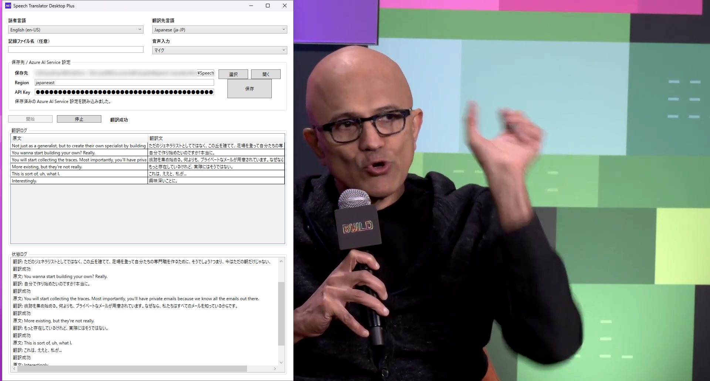

# Speech Translator Desktop Plus

[English README](README.md)

Speech Translator Desktop Plus は、[Azure AI Speech](https://azure.microsoft.com/ja-jp/products/ai-services/ai-speech) を使った Windows デスクトップ向けのリアルタイム音声翻訳・記録アプリです。



このプロジェクトは [tsubakimoto/speech-translator](https://github.com/tsubakimoto/speech-translator) をベースにしています。元プロジェクトは MIT License です。元の著作権表示とライセンス文は [LICENSE](./LICENSE) に残しています。

## 機能

- Azure AI Speech によるリアルタイム音声翻訳
- マイク入力
- WASAPI loopback による PC 音声入力
  - YouTube、ライブ配信、PC で再生中の音声を VB-CABLE なしで翻訳できます
- 翻訳ログは新しいものが上に表示されるため、最新テキストをスクロールせず確認できます
- UTF-8 テキストとして翻訳ログを保存
- 保存先フォルダーの選択、永続化、フォルダーを開く UI
- Azure Speech 認証情報と保存先をメイン画面から分離した設定ウィンドウ
- 日本語 / 英語 UI の切り替え
- 主要な音声翻訳言語を話者言語・翻訳先言語として選択可能
- Azure AI Speech のリージョン/APIキーを SQLite に保存
  - APIキーは Windows DPAPI で保護されます
- 自己完結型 Windows publish と zip パッケージ作成スクリプトに対応

## fork元からの主な変更点

[tsubakimoto/speech-translator](https://github.com/tsubakimoto/speech-translator) と比べて、この Plus fork では次を追加・改善しています。

- デスクトップアプリ名を **Speech Translator Desktop Plus** に変更
- カスタムアプリアイコンを追加
- WASAPI loopback による PC 音声キャプチャ
- `マイク + PC音声` 入力モード
- ライブ配信やメモ取りに使いやすいよう、既定の入力は `マイク + PC音声`
- 翻訳ログ・状態ログを新しい順に表示
- 翻訳テーブルのセルを最大3行程度で折り返し表示
- 空の翻訳行を抑止
- ログクリア操作
  - 画面上の翻訳ログ・状態ログをクリアし、次回開始時は新しい記録ファイルを作成します
- 最新3件だけを別ウィンドウで表示する `別ウィンドウで翻訳を開く` 機能
- 保存先フォルダーの選択・永続化
- 翻訳に集中できるよう、Azure設定と保存先設定を専用の設定ウィンドウへ移動
- `開く` / `選択` UI
- 日本語 / 英語 UI 切り替え
- 主要言語の選択肢追加
- 英語READMEをメインにし、日本語READMEを別ファイル化
- ワンコマンドセットアップ、自己完結型publish、Release zip作成スクリプト
- exeベースで導入しやすいGitHub Release配布

## おすすめセットアップ

### 方法1: Release zip をダウンロード

1. 最新の GitHub Release を開きます。
2. `SpeechTranslatorDesktopPlus-win-x64.zip` をダウンロードします。
3. 任意の書き込み可能なフォルダーへ展開します。
4. `SpeechTranslatorDesktopPlus.exe` を実行します。

### 方法2: ソースからワンコマンドセットアップ

リポジトリルートで実行します。

```powershell
.\scripts\setup.ps1
```

セットアップスクリプトは、必要に応じてユーザー領域に .NET 10 SDK を導入し、自己完結型の Windows ビルドを `%LOCALAPPDATA%\Programs\SpeechTranslatorDesktopPlus` に配置し、デスクトップショートカットを作成します。

## ソースから起動

```powershell
.\scripts\run-dev.ps1
```

または:

```cmd
scripts\run-dev.cmd
```

## 基本的な使い方

1. UI言語として `日本語` または `English` を選択します。
2. `設定` を開き、Azure AI Speech の `Region` と `API Key` を保存します。
3. 話者言語と翻訳先言語を選択します。
4. 音声入力を選択します。
   - `マイク`
   - `PC音声（既定の再生デバイス）`
   - `マイク + PC音声`（既定）
5. 必要に応じて記録ファイル名を入力します。
   - 英数字、`-`、`_` のみ使用できます
6. `開始` を押します。
7. `ログクリア` を押すと、画面上の翻訳ログ・状態ログをクリアします。記録ファイル名が設定されている場合、次回の `開始` では前回ファイルへ追記せず、タイムスタンプ付きの新しい記録ファイルを作成します。
8. `別ウィンドウで翻訳を開く` を押すと、原文・翻訳文の最新3件だけを別ウィンドウで確認できます。

記録ファイル名が空の場合、翻訳は画面に表示されますがテキストファイルには保存されません。

原文または翻訳文が空の行は、UIにも記録ファイルにも出さないようにしています。

## 保存先フォルダー

`設定` から、翻訳ログを保存するフォルダーを選択・開くことができます。

選択した保存先はローカル設定DBに保存されます。保存先を選択していない場合は、アプリ実行ファイルから見た `recordings/` 配下に保存されます。

## publish と zip 作成

任意フォルダーへ配置:

```powershell
.\scripts\publish.ps1 -InstallPath "$env:LOCALAPPDATA\Programs\SpeechTranslatorDesktopPlus" -CreateDesktopShortcut
```

Release zip 作成:

```powershell
.\scripts\package.ps1
```

補助スクリプトは [`scripts/`](scripts/) にまとめ、リポジトリルートを見やすくしています。

## コンソールアプリ

元のコンソールアプリも残しています。

1. Azure AI Speech リソースを作成します。([Bicep](./infra/main.bicep))
2. Azure Portal から `Subscription Key` と `Region` をコピーします。
3. `src/SpeechTranslatorConsole/appsettings.Development.json` を作成します。
4. `appsettings.Development.json` を設定します。

    ```json
    {
        "Settings": {
            "Region": "<Region>",
            "SubscriptionKey": "<Subscription Key>"
        }
    }
    ```

5. 翻訳対象のマイクデバイスを既定の入力デバイスに設定します。
6. 実行します。

    ```powershell
    dotnet run --project src/SpeechTranslatorConsole
    ```

## 参考

- https://learn.microsoft.com/azure/ai-services/speech-service/language-identification
- https://learn.microsoft.com/azure/ai-services/speech-service/how-to-translate-speech
- https://learn.microsoft.com/azure/ai-services/speech-service/speech-translation

## ライセンスと帰属

このリポジトリは MIT License で配布します。詳細は [LICENSE](./LICENSE) を参照してください。

ベース:

- 元リポジトリ: https://github.com/tsubakimoto/speech-translator
- 元の著作権表示: `Copyright (c) 2023 Yuta Matsumura`
- 元ライセンス: MIT License
