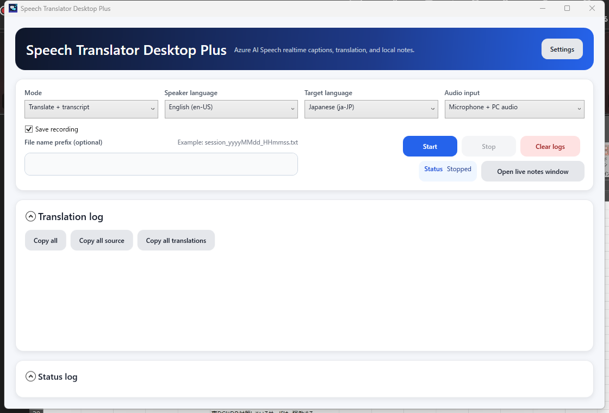
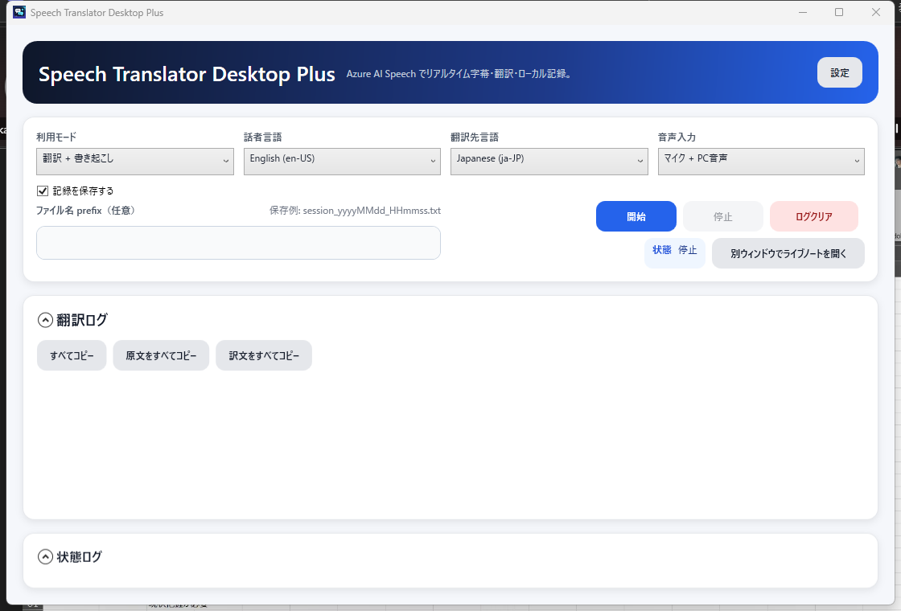
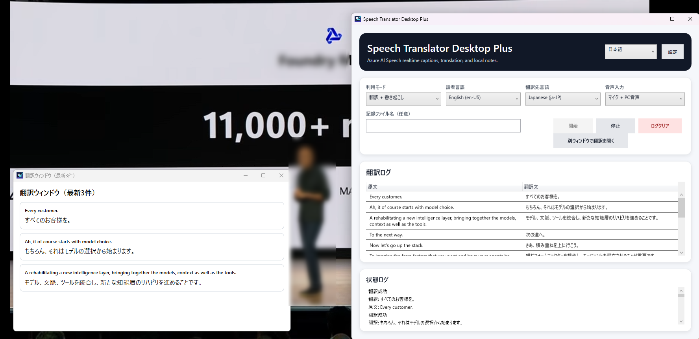

# Speech Translator Desktop Plus

[日本語 README](README.ja.md)

Speech Translator Desktop Plus is a Windows desktop speech translator and recorder using [Azure AI Speech](https://azure.microsoft.com/en-us/products/ai-services/ai-speech).

This project is based on [tsubakimoto/speech-translator](https://github.com/tsubakimoto/speech-translator). The original project is licensed under the MIT License. The original copyright and license text are preserved in [LICENSE](./LICENSE).

> Documentation target: version 1.8.5.

## Screenshots

### English UI



### Japanese UI



### Livestream translation example



## Features

- Real-time speech translation with Azure AI Speech.
- Microphone input.
- PC audio input using WASAPI loopback, so YouTube, livestreams, and other system playback can be translated without VB-CABLE.
- Translation logs are shown newest-first, so the latest text stays visible.
- Translation and status logs can be collapsed when you want a smaller live workspace.
- The main control card keeps status and recording-save hints inline to avoid unnecessary vertical whitespace.
- Transcript-only mode for cases where translation is not needed.
- Translation/transcription log recording as UTF-8 text, with automatic timestamped file names.
- One-click copy for all live log entries, an individual card, source text only, or translation text only. Per-card copy actions sit beside the text so they do not consume a separate row.
- Last-used UI language, source language, target language, input source, mode, save setting, and file name prefix are saved as soon as they change and restored on the next launch.
- Recording folder selection, persistence, and "open folder" UI.
- Dedicated settings window for UI language, Azure Speech credentials, and recording folder controls.
- Japanese and English UI language switching.
- Major speech translation languages are available from the source/target language selectors.
- Azure AI Speech region/API key persistence in SQLite with the API key protected by Windows DPAPI.
- Self-contained Windows publish and zip packaging scripts for easy setup.

## Changes from the upstream fork

Compared with [tsubakimoto/speech-translator](https://github.com/tsubakimoto/speech-translator), this Plus fork adds:

- Desktop app branding as **Speech Translator Desktop Plus**.
- A custom application icon.
- Modern card-based desktop UI focused on live captioning and note-taking.
- Card-based live log view instead of a spreadsheet-style grid.
- A mode selector for `Translate + transcript` and `Transcript only`.
- PC audio capture via WASAPI loopback.
- Combined `Microphone + PC audio` input mode.
- `Microphone + PC audio` is the default input mode for livestream translation and note-taking.
- Transcript-only mode using Azure Speech recognition when translation is unnecessary.
- Last-used language/input/mode/save/prefix preferences are persisted immediately and restored.
- Save recording toggle and automatic `{prefix}_yyyyMMdd_HHmmss.txt` file naming.
- Newest-first translation and status logs.
- Collapsible translation and status log sections.
- Compact main controls with status and recording preview placed beside related controls.
- One-click copy for all logs, source-only logs, translation-only logs, and per-card copy actions.
- Compact activity feed for status events.
- Wrapped live-note cards for readable source and translation text.
- Compact live-note cards in both the main window and the pop-out window.
- Empty translation row suppression.
- Clear logs action that resets only the on-screen logs; recording files are already created fresh on each start.
- Optional live-notes pop-out window with card-style monitoring for the three newest source/transcript or source/translation pairs.
- Configurable and persisted recording folder.
- Dedicated settings window for UI language, credentials, and recording folders to keep the main translation screen focused.
- `Open folder` and `Choose folder` controls.
- Japanese/English UI switching from `Settings`.
- Additional source/target language choices.
- English-first README plus separate Japanese README.
- One-command setup, self-contained publish, and release zip packaging scripts.
- GitHub Release asset support for easy exe-based installation.

## Recommended setup

### Option 1: Download the release zip

1. Open the latest GitHub release.
2. Download `SpeechTranslatorDesktopPlus-win-x64.zip`. A versioned copy such as `SpeechTranslatorDesktopPlus-win-x64-1.8.5.zip` is also published for archiving.
3. Extract it to any writable folder.
4. Run `SpeechTranslatorDesktopPlus.exe`.

### Option 2: One-command setup from source

From the repository root:

```powershell
.\scripts\setup.ps1
```

The setup script installs a local .NET 10 SDK if needed, publishes a self-contained Windows build to `%LOCALAPPDATA%\Programs\SpeechTranslatorDesktopPlus`, and creates a desktop shortcut. It does not change the system-wide .NET installation.

Requirements:

- Windows 10 or later.
- Internet access when the local .NET 10 SDK is not installed yet.
- PowerShell script execution must be allowed. If Windows blocks local scripts, run PowerShell as the current user and use:

```powershell
Set-ExecutionPolicy -ExecutionPolicy RemoteSigned -Scope CurrentUser
```

If you cannot change the execution policy, run the cmd wrapper instead:

```cmd
scripts\setup.cmd
```

To remove the local app files later while keeping saved settings:

```powershell
.\scripts\uninstall.ps1
```

Use `.\scripts\uninstall.ps1 -RemoveSettings` only when you also want to delete the local settings database.

## Run from source

```powershell
.\scripts\run-dev.ps1
```

or:

```cmd
scripts\run-dev.cmd
```

## Basic usage

1. Open `Settings`.
2. Select UI language: `日本語` or `English`. The choice is saved immediately.
3. Save the Azure AI Speech `Region` and `API Key`.
4. Select mode:
   - `Translate + transcript`
   - `Transcript only`
5. Select source language and, when translation is enabled, target language.
6. Select audio input:
   - `Microphone`
   - `PC audio (default playback device)`
   - `Microphone + PC audio` (default)
7. Choose whether to save recordings. Saving is on by default.
8. Optionally enter a file name prefix, using letters/numbers/`-`/`_` only.
   - Empty prefix uses `session`.
   - Each start creates a new `{prefix}_yyyyMMdd_HHmmss.txt` file, for example `build2026_20260603_080250.txt`.
9. Click `Start`.
10. Click `Clear logs` to clear the visible translation/status logs. Recording files are already created fresh on each start.
11. Collapse `Translation log` or `Status log` when you want to reduce the visible log area.
12. Use `Copy all`, `Copy all source`, or `Copy all translations` to copy the full live log in different formats. Use `Copy`, `Copy source`, or `Copy translation` on a card to copy only that block. For keyboard shortcuts, first click the live log list or press `Tab` until the list is focused, select a card, then use `Ctrl+C` for the selected block, `Ctrl+Shift+C` for source text, and `Ctrl+T` for translation text.
13. Click `Open live notes window` to open a separate window that shows only the three newest source/transcript or source/translation pairs.

If `Save recording` is off, translation/transcription is shown in the UI but not saved to a text file.

Your last-used UI language, mode, source language, target language, audio input, save setting, and prefix are saved locally and restored when you launch the app again.

Rows with no source text are ignored. In translation mode, rows with no translated text are also ignored to avoid blank lines in the UI and recording files.

## Troubleshooting

| Problem | What to check |
| --- | --- |
| Setup fails before publishing | Confirm Windows 10 or later. If .NET download fails, check internet/proxy settings or install .NET 10 SDK manually, then run `.\scripts\setup.ps1 -SkipDotNetInstall`. |
| PowerShell blocks scripts | Use `scripts\setup.cmd`, or allow local scripts with `Set-ExecutionPolicy -ExecutionPolicy RemoteSigned -Scope CurrentUser`. |
| App says Azure credentials are missing | Open `Settings` and save the Azure AI Speech `Region` and `API Key`, or set `SPEECH_REGION` and `SPEECH_KEY` as user environment variables before launching the app. |
| No microphone or PC audio is recognized | Check Windows privacy permissions for microphone access and confirm the playback device you want is the Windows default device. |
| Settings or recording folder changes do not persist | Use a writable install folder and confirm `%LOCALAPPDATA%\SpeechTranslatorDesktop` can be written. |
| Release zip integrity check is needed | Download `SHA256SUMS.txt` from the release and compare it with `Get-FileHash -Algorithm SHA256 .\SpeechTranslatorDesktopPlus-win-x64.zip`. |

## Azure AI Speech free tier

As a reference, Azure AI Speech currently offers a **Free (F0)** tier that can be useful for trying this app before moving to pay-as-you-go.

As of 2026-06-03, the Azure Speech pricing page lists:

- Speech to Text: Real-time Transcription, 5 audio hours free per month.
- Speech Translation: Standard, 5 audio hours free per month.
- Text to Speech: Neural, 0.5 million characters free per month.

Free tier availability, quotas, and included amounts can change. Check the official pricing and quota pages before relying on these limits:

- Azure Speech pricing: https://azure.microsoft.com/pricing/details/cognitive-services/speech-services/
- Azure Speech quotas and limits: https://learn.microsoft.com/azure/ai-services/speech-service/speech-services-quotas-and-limits

## Recording folder

Use `Settings` to choose and open the folder where translation logs are saved.

The selected folder is persisted in the local settings database. If no custom folder is selected, logs are saved under `recordings/` relative to the app executable directory.

## Publish and package

Publish to a folder:

```powershell
.\scripts\publish.ps1 -InstallPath "$env:LOCALAPPDATA\Programs\SpeechTranslatorDesktopPlus" -CreateDesktopShortcut
```

Create a release zip:

```powershell
.\scripts\package.ps1
```

The desktop release asset is named `SpeechTranslatorDesktopPlus-win-x64.zip`, with a versioned copy named `SpeechTranslatorDesktopPlus-win-x64-{version}.zip` for archiving. `SHA256SUMS.txt` is uploaded with release checksums. The GitHub Actions workflow also uploads a console zip for source users who want the original console app.

Helper scripts live in [`scripts/`](scripts/) to keep the repository root focused.

## Console app

The original console app remains available:

1. Create Azure AI Speech resource. ([Bicep](./infra/main.bicep))
2. Copy `Subscription Key` and `Region` from Azure Portal.
3. Create `src/SpeechTranslatorConsole/appsettings.Development.json`.
4. Setup `appsettings.Development.json`:

    ```json
    {
        "Settings": {
            "Region": "<Region>",
            "SubscriptionKey": "<Subscription Key>"
        }
    }
    ```

5. Set the microphone device for translation as the default input device.
6. Run:

    ```powershell
    dotnet run --project src/SpeechTranslatorConsole
    ```

## References

- https://learn.microsoft.com/en-us/azure/ai-services/speech-service/language-identification
- https://learn.microsoft.com/en-us/azure/ai-services/speech-service/how-to-translate-speech
- https://learn.microsoft.com/en-us/azure/ai-services/speech-service/speech-translation

## License and attribution

This repository is distributed under the MIT License. See [LICENSE](./LICENSE).

Based on:

- Original repository: https://github.com/tsubakimoto/speech-translator
- Original author/license notice: `Copyright (c) 2023 Yuta Matsumura`
- Original license: MIT License
